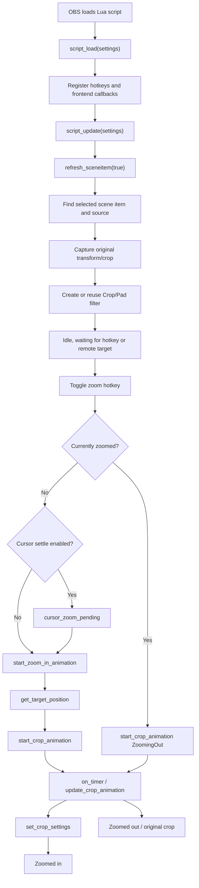
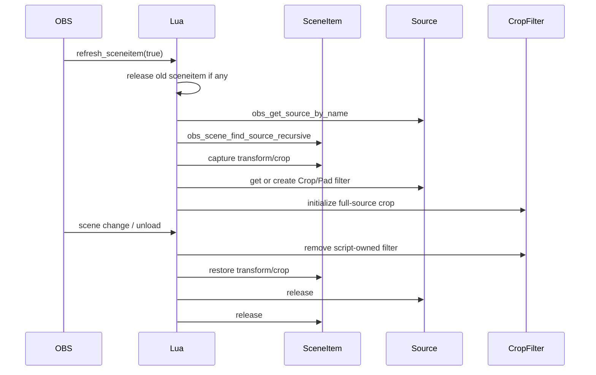
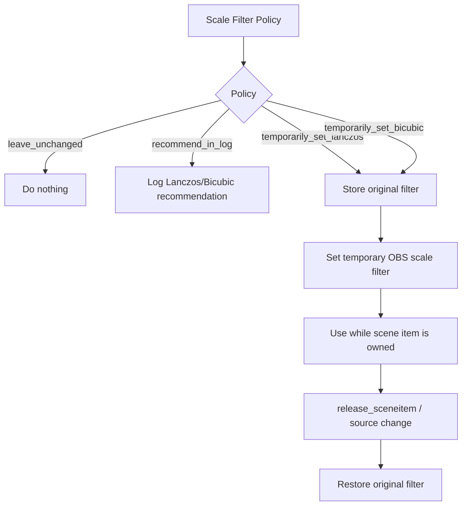

# OBS Zoom to Mouse Lua Design and Architecture

## Purpose

This document describes the current design and architecture of the maintained Lua implementation in `obs-zoom-to-mouse.lua`.

It replaces the earlier milestone-style natural-animation implementation report. The natural zoom guidelines still inform the architecture, but this document is now organized around how the Lua script works: OBS lifecycle hooks, source ownership, coordinate mapping, target selection, camera animation, follow behavior, remote control, scale filtering, and verification.

## Architecture Summary

The Lua script is a single OBS script that behaves like a virtual camera over a selected OBS source. It does not render a custom scene, use a native plugin, or animate individual UI elements. Instead, it adds an OBS `Crop/Pad` filter to the selected source and updates that filter over time.

At runtime, the script:

1. Discovers a zoom source in the current scene.
2. Stores the source's original transform and crop state.
3. Creates or reuses a Crop/Pad filter named `obs-zoom-to-mouse-crop`.
4. Converts cursor or remote target coordinates into source-space target crop rectangles.
5. Animates from the current crop to the target crop using duration-based easing.
6. Optionally waits for the cursor to settle before zoom-in.
7. Optionally follows the cursor while zoomed.
8. Restores temporary scene-item state when the source changes, the script unloads, or OBS changes scenes.

The design intentionally keeps the visual layer unified: the entire captured source moves as one layer, which is why the result feels like camera motion rather than detached UI animation.

## Natural Zoom Conformance

The original design question was how closely this project could implement natural screen-recording zoom guidelines in Lua. Approximately 80-85% of the guide is achievable without changing OBS Studio because the script can control target selection, duration-based animation, easing, target framing bias, cursor timing, stable end states, reduced-motion presets, rectangle targets, subtle overshoot, and scene-item scale-filter guidance.

The remaining gap is mostly outside Lua's practical control: semantic UI-element recognition, native click timing, fractional crop coordinates inside OBS's built-in Crop/Pad filter, custom shader sampling, and full post-encode quality analysis.

## Maintained Implementation Boundary

The Lua implementation is the canonical implementation.

```text
Repository
|
+-- obs-zoom-to-mouse.lua                  maintained runtime
+-- docs/USER_GUIDE.md                     operator guide
+-- docs/RETINA_DISPLAY_FIX.md             macOS display-coordinate notes
+-- docs/LUA_SCRIPT_DESIGN_AND_ARCHITECTURE.md  architecture guide
+-- tests/test_lua_natural_zoom_animation.py
+-- tests/obs_lua_smoke.lua
+-- tests/obs_lua_target_rect.lua
+-- tests/obs_lua_scale_overshoot.lua
```

The previous Python edition has been removed. It used the same Crop/Pad rendering route while adding a second runtime, dependency installation, and duplicate maintenance burden.

## High-Level Data Flow

```text
Hotkey / OBS event / UDP packet
        |
        v
Target acquisition
  - local mouse point
  - remote point
  - remote rectangle
        |
        v
Coordinate mapping
  - display source geometry
  - Retina / HiDPI correction
  - manual override when needed
        |
        v
Target crop calculation
  - point target
  - rectangle target
  - source-bound clamping
  - target framing bias
        |
        v
Camera animation
  - cursor settle wait
  - duration + easing
  - optional overshoot settle
        |
        v
OBS Crop/Pad update
  - left/top/cx/cy
  - obs_source_update(...)
        |
        v
Scene output
```

The same flow also powers follow mode after zoom-in; the difference is that follow mode updates the crop target continuously while the source is zoomed.

## Mermaid Overview



## Core Runtime State

The script is a stateful OBS Lua script. The important state groups are:

| State Group | Representative Variables | Purpose |
|-------------|--------------------------|---------|
| OBS resource ownership | `source`, `sceneitem`, `crop_filter`, `crop_filter_settings` | Handles references to OBS source, scene item, and the Crop/Pad filter. |
| Original scene state | `sceneitem_info_orig`, `sceneitem_crop_orig`, `crop_filter_info_orig` | Allows the script to restore state when releasing the source. |
| Camera state | `zoom_info`, `zoom_target`, `crop_filter_info`, `camera_animation` | Represents source dimensions, target crop, current crop, and in-flight animation. |
| Interaction state | `zoom_state`, `is_following_mouse`, `locked_center`, `locked_last_pos` | Controls zoom/follow lifecycle and safe-zone behavior. |
| Cursor coordination | `cursor_zoom_pending` plus cursor-stability settings | Delays zoom-in until the cursor is stable or max wait is reached. |
| Remote target state | `socket_server`, `socket_mouse`, `socket_target` | Receives UDP point or rectangle targets. |
| Display mapping | `monitor_info`, `retina_mode`, `last_source_dimensions` | Maps desktop cursor coordinates into captured source pixels. |
| Scale-filter restore | `scale_filter_policy`, `scale_filter_restore` | Optionally changes OBS scene-item scale filtering and restores the original value. |

The implementation is intentionally table-oriented rather than class-oriented because it is an OBS Lua script, not a library.

## Enumerations and Settings Model

The script defines small string enums for user-facing settings:

| Enum | Values | Used By |
|------|--------|---------|
| `MotionPreset` | `tutorial`, `quick_focus`, `detailed_inspection`, `energetic_demo`, `reduced_motion`, `custom` | Preset dropdown and preset application. |
| `Easing` | `linear`, `ease_out_cubic`, `ease_in_out_cubic`, `ease_out_quart`, `ease_in_out_quart` | Zoom-in, zoom-out, and overshoot animation segments. |
| `TargetKind` | `point`, `rect` | Local/remote target model. |
| `ScaleFilterPolicy` | `leave_unchanged`, `recommend_in_log`, `temporarily_set_lanczos`, `temporarily_set_bicubic` | Optional scene-item scale filter helper. |
| `OvershootMode` | `off`, `subtle` | Optional zoom-in overshoot settle. |
| `RetinaMode` | `auto`, `force_points`, `force_pixels` | macOS display-coordinate handling. |

Defaults are set in `script_defaults(settings)`. Runtime values are loaded in `script_load(settings)` and refreshed in `script_update(settings)`.

## OBS Lifecycle

The OBS script lifecycle is anchored by standard script entrypoints:

| Function | Responsibility |
|----------|----------------|
| `script_description()` | Short description shown in OBS. |
| `script_properties()` | Builds the OBS Scripts UI. |
| `script_defaults(settings)` | Defines default settings. |
| `script_load(settings)` | Initializes hotkeys, callbacks, settings, and script state. |
| `script_update(settings)` | Reads changed settings and refreshes dependent state. |
| `script_save(settings)` | Saves hotkey bindings. |
| `script_unload()` | Releases timers, callbacks, sources, sockets, and temporary scene state. |

ASCII lifecycle:

```text
OBS starts / script added
        |
        v
script_defaults -> script_load -> script_properties
        |              |
        |              +-- register hotkeys
        |              +-- register frontend callbacks
        |              +-- load saved settings
        v
script_update whenever settings change
        |
        +-- source changed -> refresh_sceneitem(true)
        +-- socket changed -> start/stop UDP server
        +-- scale filter changed -> apply/restore policy
        |
        v
script_save / script_unload
```

Frontend callbacks respond to scene changes, OBS finished-loading, scripting shutdown, and transition starts. The important operational rule is that scene-item state must be restored before the script loses ownership of the current item.

## OBS Resource Ownership

`refresh_sceneitem(find_newest)` and `release_sceneitem()` form the ownership pair.

`refresh_sceneitem(true)`:

1. Calls `release_sceneitem()` if replacing the current item.
2. Finds the named source.
3. Finds the matching scene item in the current scene hierarchy.
4. Captures original transform and crop.
5. Detects source dimensions.
6. Reads existing Crop/Pad filters that affect source-space geometry.
7. Creates or reuses `obs-zoom-to-mouse-crop`.
8. Sets the initial full-source crop.
9. Applies the optional scale-filter policy.

`release_sceneitem()`:

1. Stops timers.
2. Clears animation and pending cursor state.
3. Restores any temporary scale-filter change.
4. Removes the script-owned Crop/Pad filter.
5. Removes temporary conversion filters.
6. Releases OBS data/settings objects.
7. Restores original transform and crop.
8. Releases scene item and source references.



This ownership discipline is what lets the script mutate OBS state while still returning the scene to normal.

## Source and Coordinate Mapping

The script needs to map a desktop cursor position into source coordinates. That requires knowing:

- Which desktop display the OBS source captures.
- The display's top-left position.
- The display's logical size.
- The source's captured pixel size.
- Any transform crop or Crop/Pad filter already applied.
- Any Retina or HiDPI scale factor.

Important functions:

| Function | Role |
|----------|------|
| `get_dc_info()` | Platform-specific OBS display-capture source IDs and property names. |
| `get_monitor_info(source, source_pixels)` | Resolves source display geometry. |
| `parse_display_name(display_name)` | Parses display strings such as dimensions and position. |
| `derive_macos_display_metrics(...)` | Distinguishes macOS point-space vs pixel-space display names. |
| `get_mouse_source_point(zoom)` | Converts current mouse position into source-space point. |

On macOS, the script can use native display geometry through FFI where possible. If automatic detection fails, `Set manual source position` becomes the explicit override path.

Coordinate flow:

```text
OS cursor position
        |
        v
monitor_info x/y/scale/display size
        |
        v
source crop/filter offsets
        |
        v
source-space point
        |
        v
target crop calculation
```

## Target Model

The target model supports both points and rectangles:

```lua
Target = {
    kind = "point" or "rect",
    x = number,
    y = number,
    w = number,
    h = number,
    coordinate_space = "source",
}
```

Targets are resolved by `get_target_position_for_target(zoom, target)`:

| Target | Function | Behavior |
|--------|----------|----------|
| Local cursor point | `get_point_target_position(zoom, nil)` | Uses current mouse position after coordinate mapping. |
| Remote point | `get_point_target_position(zoom, target)` | Uses externally supplied source-like point target. |
| Remote rectangle | `get_rect_target_position(zoom, target)` | Frames a whole source-coordinate rectangle with margin. |

The target result includes:

- `crop`: the destination crop rectangle.
- `raw_center`: target center before clamping.
- `clamped_center`: final target center after clamping.
- `kind`: point or rectangle.

## Target Framing and Clamping

The script uses target framing bias:

```lua
target_screen_x = 0.50
target_screen_y = 0.45
```

This places the target horizontally centered and slightly above vertical center. That usually feels more natural for demos because it leaves space below the target for cursor movement and context.

Point target crop:

```text
crop.w = source_width / zoom_factor
crop.h = source_height / zoom_factor
crop.x = point.x - crop.w * 0.50
crop.y = point.y - crop.h * 0.45
crop = clamp_crop_to_source_bounds(crop)
```

Rectangle target crop:

```text
min_w = rect.w * target_rect_margin
min_h = rect.h * target_rect_margin
crop.w = max(source_width / zoom_factor, min_w, min_h * source_aspect)
crop.h = crop.w / source_aspect
crop.x = rect_center_x - crop.w * 0.50
crop.y = rect_center_y - crop.h * 0.45
crop = clamp_crop_to_source_bounds(crop)
```

For rectangles, keeping the region visible is more important than preserving the exact framing bias near source edges.

## Camera Animation

The animation model is duration-based:

```lua
camera_animation = {
    active = false,
    state = ZoomState.None,
    from = nil,
    to = nil,
    elapsed_ms = 0,
    duration_ms = 420,
    easing = Easing.EaseOutCubic,
    settle_to = nil,
    settle_duration_ms = 0,
    settle_easing = Easing.EaseOutCubic,
    lock_target = false,
}
```

The primary functions are:

| Function | Role |
|----------|------|
| `start_crop_animation(...)` | Captures `from`, `to`, duration, easing, and optional settle segment. |
| `update_crop_animation(elapsed_ms)` | Advances animation, interpolates crop, applies it to OBS. |
| `start_zoom_in_animation(target)` | Builds the zoom-in target and optional overshoot segment. |
| `begin_zoom_in()` | Starts cursor-settle flow or immediate zoom-in. |
| `on_timer(elapsed_ms)` | Drives cursor pending state, crop animation, and follow behavior. |

Animation loop:

```text
elapsed_ms += frame_delta
t = clamp(0, 1, elapsed_ms / duration_ms)
eased = apply_easing(easing, t)
current = lerp(from, to, eased)
set_crop_settings(current)
```

This replaces the old frame-step `zoom_speed` model. The report still references duration-based animation explicitly because it is a key architectural shift.

## Motion Presets

Presets are defined in `MotionPresetSettings` and copied into OBS settings by `apply_motion_preset_to_settings(settings, preset)`.

| Preset | Zoom Factor | Zoom In | Zoom Out | Zoom In Easing | Zoom Out Easing | Overshoot |
|--------|-------------|---------|----------|----------------|-----------------|-----------|
| Tutorial | `1.45` | `420ms` | `320ms` | `ease_out_cubic` | `ease_in_out_cubic` | Off |
| Quick Focus | `1.35` | `280ms` | `240ms` | `ease_out_cubic` | `ease_out_cubic` | Off |
| Detailed Inspection | `1.75` | `500ms` | `360ms` | `ease_in_out_cubic` | `ease_in_out_cubic` | Off |
| Energetic Demo | `1.60` | `350ms` | `260ms` | `ease_out_quart` | `ease_out_cubic` | Subtle |
| Reduced Motion | `1.15` | `100ms` | `100ms` | `ease_out_cubic` | `ease_out_cubic` | Off |
| Custom | User-defined | User-defined | User-defined | User-defined | User-defined | User-defined |

Legacy saved settings are handled by `migrate_legacy_motion_preset(settings)`. If old `zoom_value` or `zoom_speed` data exists without an explicit preset, the preset is marked `Custom` so OBS does not display `Tutorial` while preserving older behavior.

## Cursor Stability Delay

Cursor stability delay coordinates zoom timing with cursor movement.

```text
Zoom hotkey
   |
   v
start_pending_zoom_in()
   |
   v
sample latest target each timer tick
   |
   +-- stable for 150ms -> start_zoom_in_animation(latest target)
   |
   +-- max wait 250ms -> start_zoom_in_animation(latest target)
```

State is stored in `cursor_zoom_pending`:

| Field | Meaning |
|-------|---------|
| `active` | Whether a zoom-in is waiting for cursor stability. |
| `elapsed_ms` | Total wait time. |
| `stable_ms` | Continuous stable time. |
| `last_center` | Last sampled target center. |
| `target` | Latest candidate target. |

This keeps the hotkey responsive while avoiding zooms that start during fast cursor travel.

## Follow and Safe-Zone Behavior

After zoom-in, the script can follow the cursor.

The follow system is intentionally separate from the main zoom-in/out camera animation:

- `camera_animation` handles transitions into and out of zoom.
- Follow mode updates `crop_filter_info` continuously while zoomed.
- `locked_center` and related state create a safe zone so the camera does not constantly drift.

Follow behavior:

```text
Zoomed in
   |
   v
Auto follow enabled?
   |
   +-- no -> camera stays stable
   |
   +-- yes -> follow cursor when it reaches follow border
                 |
                 v
             move crop with follow_speed
                 |
                 v
             lock when close enough or reverse-direction lock triggers
```

This matches the screen-recording goal: guide attention, then let the viewer read.

## Overshoot Architecture

Overshoot is implemented as a two-segment zoom-in animation, not as a bounce easing curve.

```text
current crop
    |
    | 82% of zoom-in duration, ease_out_quart
    v
slightly smaller overshoot crop
    |
    | 18% of zoom-in duration, ease_out_cubic
    v
final target crop
```

Key functions:

| Function | Role |
|----------|------|
| `build_overshoot_crop(zoom, final_crop, percent)` | Converts a tiny scale overshoot into a smaller crop around the same target anchor. |
| `create_overshoot_animation_options(...)` | Builds approach and settle animation options. |

Guardrails:

- Off by default.
- Enabled by `Energetic Demo` at `1.0%`.
- UI caps overshoot at `2.0%`.
- Skips overshoot when source-edge clamping would move the anchor by more than `1px`.
- Locks the target during the approach/settle pair so auto-follow does not retarget mid-settle.

## Scale Filter Helper

Scale filtering is an OBS scene-item setting, not a Crop/Pad filter setting. The Lua script treats it carefully because OBS persists scene-item scale filters in scene data.



The helper verifies Lua API symbol availability before mutating state:

- `obs.obs_sceneitem_get_scale_filter`
- `obs.obs_sceneitem_set_scale_filter`
- `obs.OBS_SCALE_LANCZOS`
- `obs.OBS_SCALE_BICUBIC`

If the API is not available, the helper logs and skips mutation.

## Remote Targeting

Remote targeting is optional and depends on `ljsocket.lua`.

When available, the script exposes `Enable remote mouse listener`. The listener is UDP-based and polled by `on_socket_timer()`.

Supported payloads:

```text
x y
rect x y width height
```

Remote flow:

```text
UDP packet
   |
   v
on_socket_timer()
   |
   +-- "x y" -----------------> socket_mouse
   |
   +-- "rect x y width height" -> socket_target { kind = rect }
                                      |
                                      v
                              get_target_position()
```

Point messages preserve the original remote mouse behavior. Rectangle messages let integrations frame a whole UI region.

## OBS Crop/Pad Application

All camera movement ultimately becomes integer Crop/Pad settings:

```lua
obs.obs_data_set_int(crop_filter_settings, "left", math.floor(crop.x))
obs.obs_data_set_int(crop_filter_settings, "top", math.floor(crop.y))
obs.obs_data_set_int(crop_filter_settings, "cx", math.floor(crop.w))
obs.obs_data_set_int(crop_filter_settings, "cy", math.floor(crop.h))
obs.obs_source_update(crop_filter, crop_filter_settings)
```

This is a deliberate boundary. It keeps the script Lua-only and aligned with OBS's built-in filter model, but it also means the current implementation should not promise subpixel crop movement.

## Error Handling and Recovery

The script favors recoverable runtime behavior:

| Situation | Behavior |
|-----------|----------|
| No source selected | Does not zoom; source can be selected later. |
| Source not in current scene hierarchy | Logs a warning and releases references. |
| Non-display source without manual override | Logs an error explaining that manual source position is required. |
| Source dimensions unavailable | Falls back to source/raw/monitor dimensions when possible. |
| OBS scene changes | Refreshes scene item and releases old state. |
| Transition starts | Releases scene item to avoid stale transform ownership. |
| Script unloads | Removes timers, socket, callbacks, filters, and restores state. |
| Scale-filter API missing | Skips optional mutation. |

Debug logging can be enabled through the OBS script UI. `log_current_settings()` prints the current settings, platform, OBS version, and monitor info.

## Extension Points

Useful future extension boundaries:

| Extension | Best Integration Point | Notes |
|-----------|------------------------|-------|
| New motion preset | `MotionPreset`, `MotionPresetSettings`, `add_motion_preset_options` | Keep professional presets overshoot-free unless style demands it. |
| New easing curve | `Easing`, `apply_easing`, `add_easing_options` | Avoid bounce/elastic defaults for tutorials. |
| New remote target type | `on_socket_timer`, `TargetKind`, `get_target_position_for_target` | Keep target data in source coordinates. |
| Additional scale policy | `ScaleFilterPolicy`, `scale_filter_policy_to_filter` | Preserve and restore previous OBS state. |
| Tick-based animation | Replace timer advancement with `obs_add_tick_callback` path | Only worth doing if recorded evidence shows timer jitter. |
| Native filter/plugin | Outside Lua script | Only if integer Crop/Pad or sampler control becomes a proven blocker. |

## Verification

Current verification commands:

```bash
python3 -m unittest discover -v
luajit tests/obs_lua_smoke.lua
luajit tests/obs_lua_target_rect.lua
luajit tests/obs_lua_scale_overshoot.lua
git diff --check
```

What they cover:

| Test | Coverage |
|------|----------|
| `tests/test_lua_natural_zoom_animation.py` | Static Lua contract, report architecture markers, and LuaJIT-backed test invocation. |
| `tests/obs_lua_smoke.lua` | Script loads with a stubbed `obslua` environment. |
| `tests/obs_lua_target_rect.lua` | Point/rectangle target crop math, clamping, and legacy point targeting. |
| `tests/obs_lua_scale_overshoot.lua` | Scale-filter helper behavior and overshoot crop math. |
| `git diff --check` | Whitespace and patch hygiene. |

## Design Constraints

The most important constraints are:

1. OBS Crop/Pad values are integer settings.
2. Lua timers are effectively tied to OBS video-frame timing.
3. OBS sees captured pixels, not semantic UI controls.
4. Scene-item scale filtering is persistent OBS state and must be opt-in if changed.
5. Display-capture source geometry varies by platform and can require manual override.

Given those constraints, the current architecture is intentionally conservative: Lua-only, Crop/Pad based, source-coordinate targeting, duration-based animation, optional polish features, and explicit cleanup of any OBS state the script temporarily owns.
